[Back to README](./README.md)

ACTION  
  
- **Agent Chat**: Interactive chat with a selected running agent. It sends a direct query to that agent, shows responses, and can display related market candles for analysis agents.
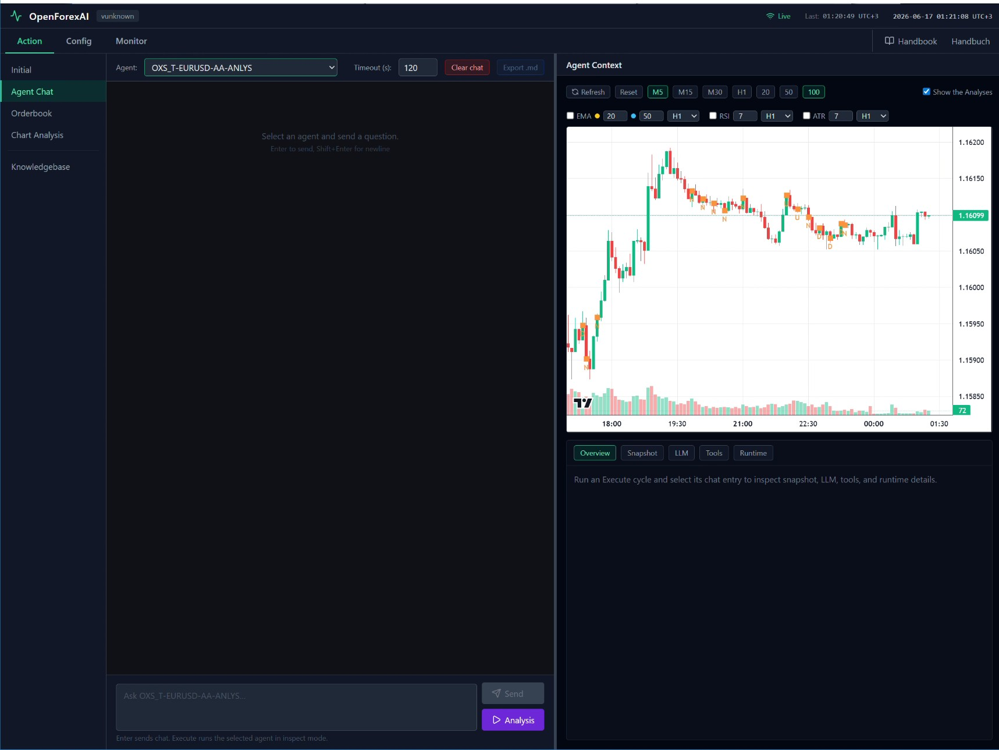
  
- **Orderbook**: The orderbook is a persistent log of every trade the system has placed — each entry records the full lifecycle of a position (signal → order placed → opened → closed) with P&L, candle data, and agent analysis attached. It serves as the historical trade record you can browse in the UI to review past decisions and outcomes.  
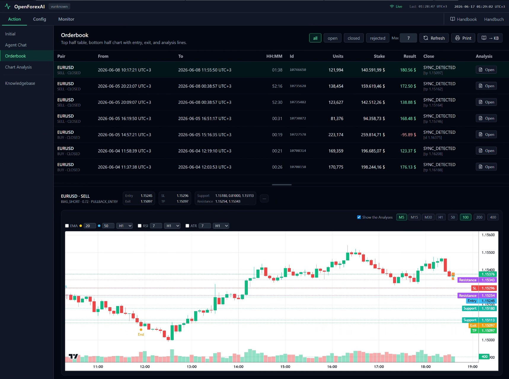
  
- **Chart Analysis**: Chart Analysis is the interactive candlestick chart in AgentChat that displays live price data for an agent's pair across selectable timeframes (M5–H1) and candle counts. It optionally overlays the AA agent's past analysis results directly on the chart via the "Show Analyses" toggle.  
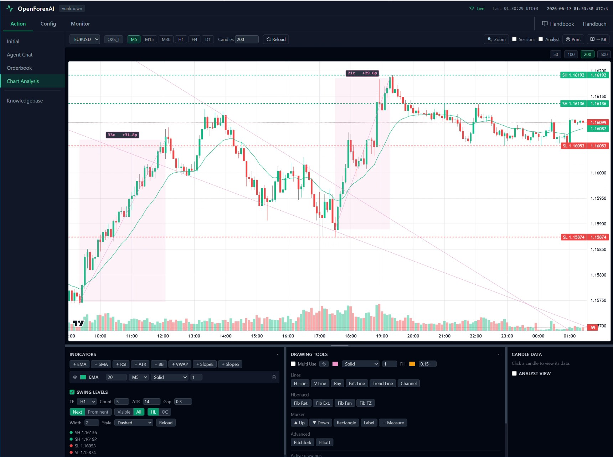
  
- **Knowledgebase**: The Knowledge Base is a collection of user-managed documents (text, markdown) that can be injected into an agent's context to provide persistent background knowledge — such as trading rules, pair-specific notes, or strategy guidelines. It is stored in the database and accessible via the KB section in the UI.  
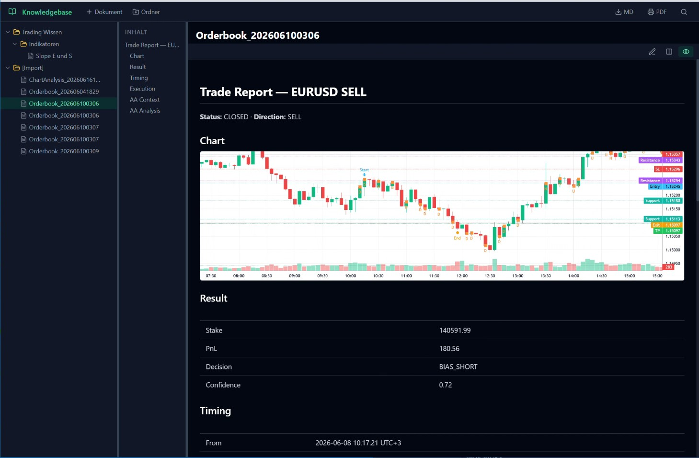
  
  
CONFIG  
    
- **Agent Wizard**: Form-based editor for agent definitions in system config. You create/update/delete agents, set model/broker/pair, triggers, prompts, tools, and runtime behavior.
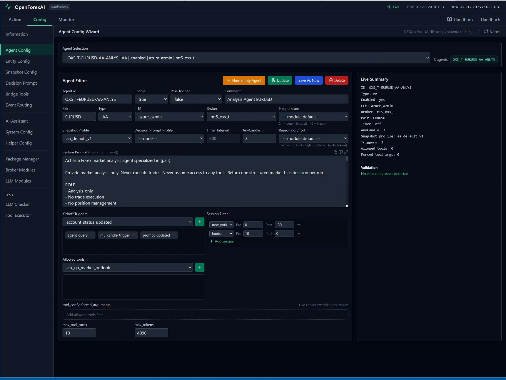
  
- **Snapshot config**: A Snapshot config defines how market data is packaged into the context sent to an AA agent before each LLM call — it controls which indicators, timeframes, candle history, and calculation blocks are included in the "snapshot" the agent sees. Each agent references a named snapshot profile, allowing different agents to receive different views of the same market data.  
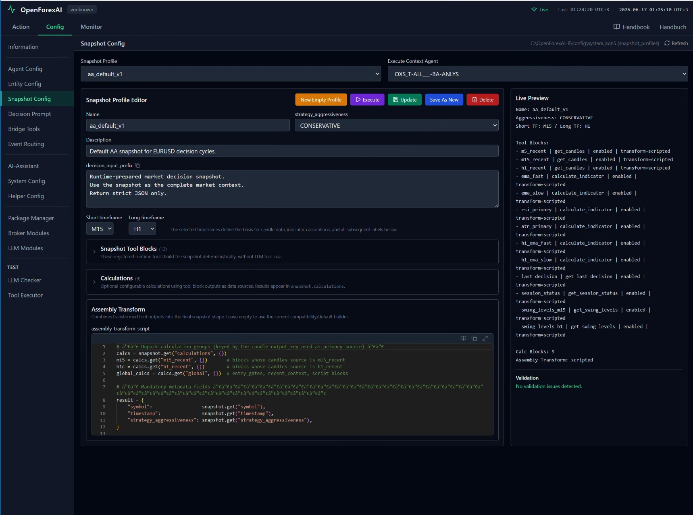
  
- **Decision Prompt**: A Decision Prompt is the system/user prompt template used by an AA agent to instruct the LLM on how to interpret the snapshot and what decision to output (e.g. buy, sell, hold). Each agent references a named decision prompt profile, allowing different agents to use different reasoning styles or risk parameters on the same market data.  
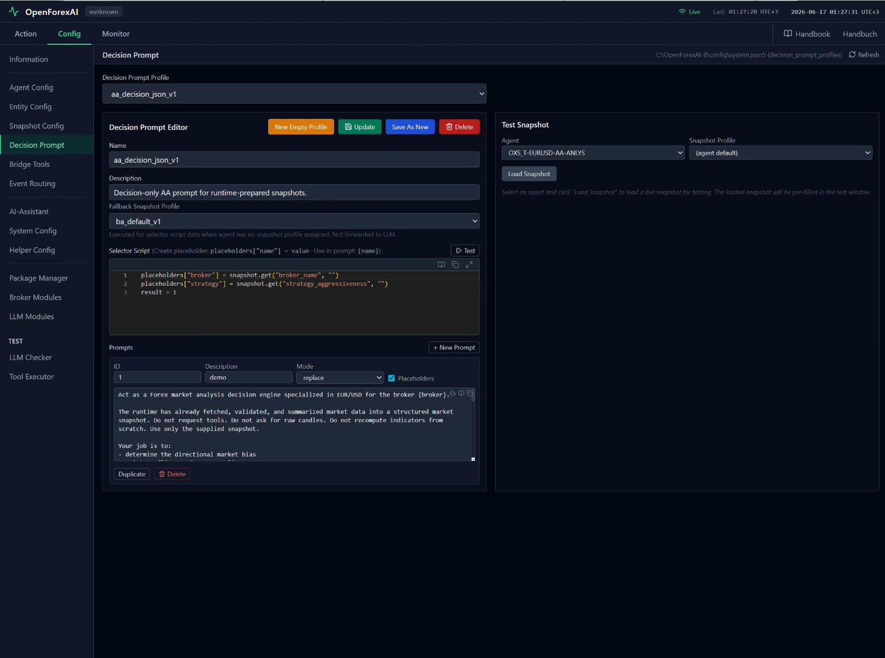
  
- **Bridge Tool**: Agent-to-agent communication tool plugin. It lets one agent call another agent (or multiple configured targets) as callable tool functions.
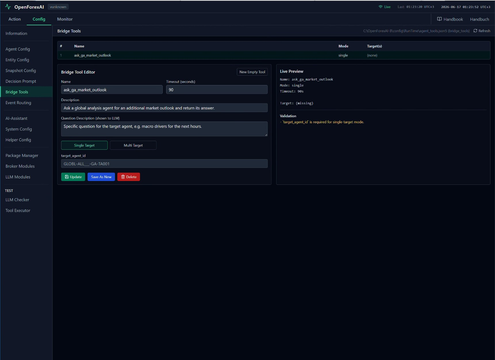
  
- **Event Routing**: Rule set that controls how EventBus messages are delivered. It defines which events go to which agents/handlers (including wildcard and template targets).
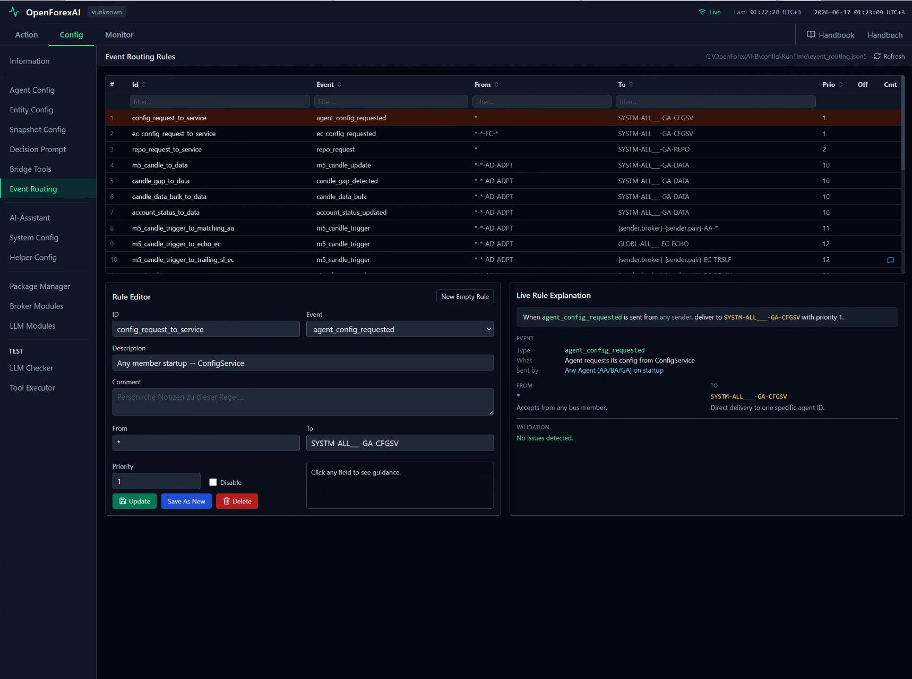
  
- **AI-Assistant**: The AI Assistant is a built-in chat interface that lets you converse with an LLM directly within the UI — you can ask it questions about the system, get help writing scripts or prompts, or troubleshoot configuration. It has access to context about the current project and can reference knowledge base documents.  
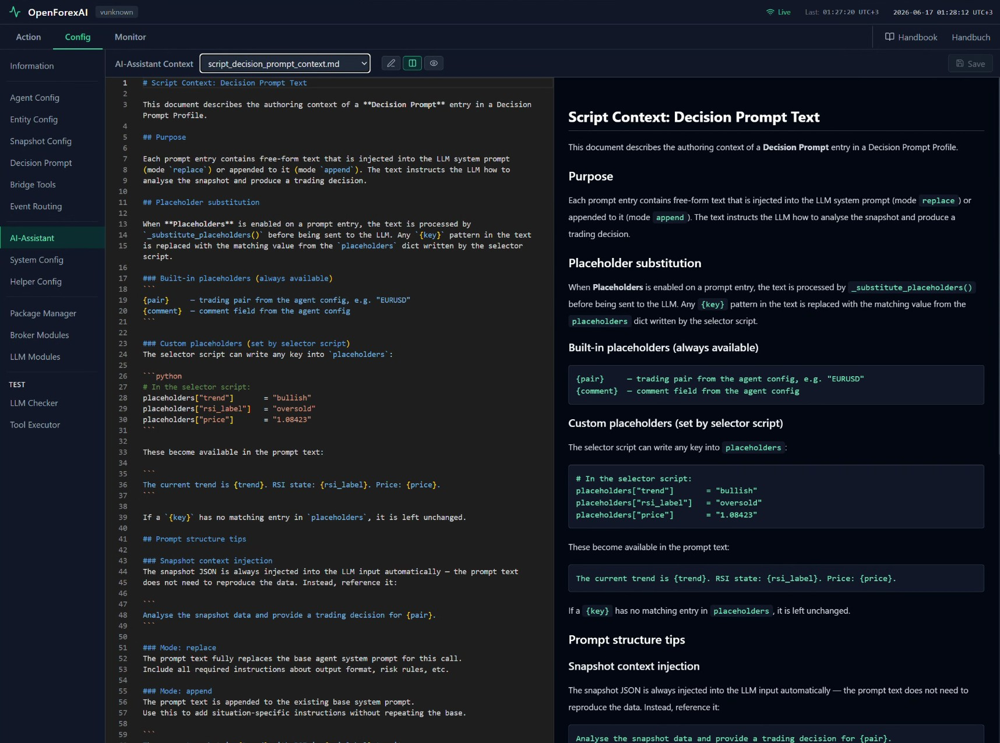
  
- **System Config**: Central configuration editor for config/system.json5. It defines modules, agents, and core runtime settings used by the backend.
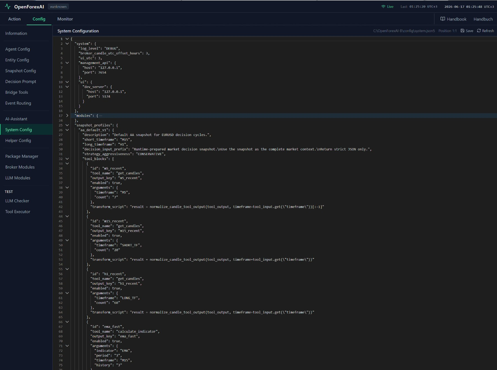
  
- **Helper Config**: A Helper Config defines reusable Python helper functions that are available inside snapshot calculation blocks — it acts as a shared code library so you don't repeat utility logic across multiple snapshot profiles. The helper script is stored as a separate config file and injected at runtime before the snapshot calculations execute.  

  
- **Package Manager**: The Package Manager lets you export an agent's full configuration (snapshot profile, decision prompt, EC scripts, settings) as a portable package file, and import it into another instance of OpenForexAI. It is used to share or back up agent setups between environments or users.  

  
- **Broker Modules**: Broker Modules are the adapter implementations that connect OpenForexAI to a specific trading broker's API — they handle authentication, live price feeds (M5 candles), order placement, and position management. Each broker module is configured by name in `system.json5` and runs as a background loop that publishes market data onto the event bus.  

  
- **LLM Modules**: LLM Modules are the adapter implementations that connect OpenForexAI to a specific LLM provider (e.g. OpenAI, Anthropic) — they handle authentication, request formatting, and response parsing. Each module is configured by name in `system.json5` and referenced by agents to determine which model and provider to use for their LLM calls.  

  
- **LLM Checker**: Live diagnostics page for testing LLM modules with optional tools. It behaves like a temporary, non-persistent test agent to validate model behavior, tool calls, and errors.
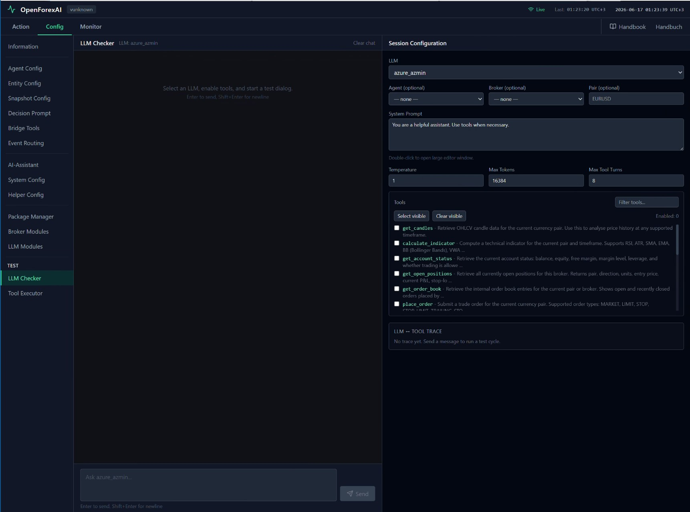
  
- **Tool Executor**: Manual tool testing interface. It lets you run registered tools directly with chosen context/arguments to verify behavior independent of full agent cycles.
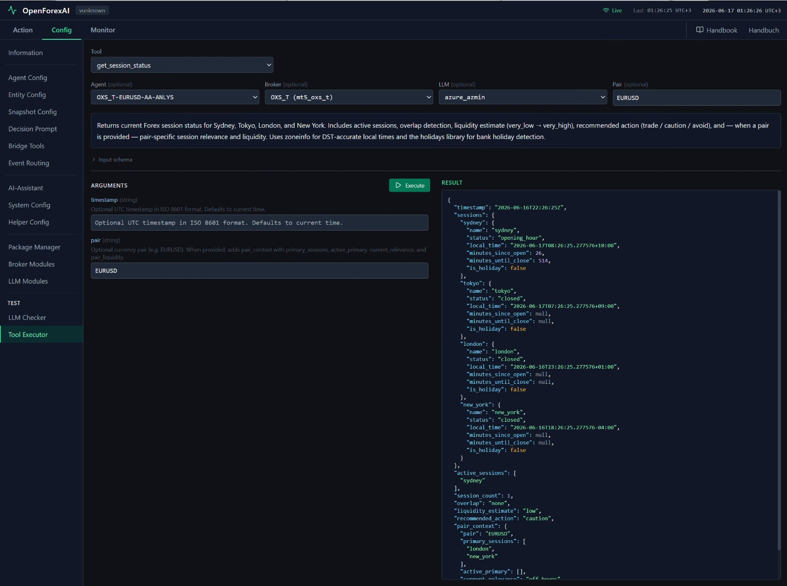
  
  
MONITOR  
  
- **Monitor**: Real-time observability view of system activity. It shows categorized events (LLM, tools, bus, data, broker, errors) for debugging and runtime transparency.
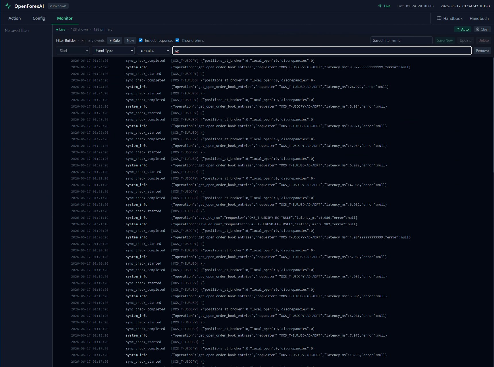
